<div align="center">

# 🧠 MarketMindAI
### Represents the Future of Strategic Market Intelligence

[](https://react.dev/)
[](https://www.typescriptlang.org/)
[](https://n8n.io/)
[](./LICENSE)

</div>

---

## 📑 Table of Contents
- [🚀 Project Overview](#-project-overview)
- [💻 UI & Features](#-ui--features)
- [⚙️ The AI Swarm Architecture](#-the-ai-swarm-architecture)
- [🛠️ Technical Stack](#-technical-stack)
- [📦 Installation & Setup](#-installation--setup)

---

## 🚀 Project Overview

> **The Problem:** Entering a new market is a high-stakes gambling game. Companies spend **weeks** and **thousands of dollars** on manual research, relying on disconnected teams (Marketing, Legal, Finance) to gather data.

**The Solution:**
**MarketMindAI** is an autonomous AI agent swarm that democratizes strategic intelligence. It orchestrates specialized AI agents to automate the entire market-entry research process—from data gathering to strategy generation—in **minutes**.

### 🎯 Business Impact
| Metric | Traditional Method | MarketMindAI |
| :--- | :--- | :--- |
| **Time to Insight** | 2-4 Weeks | < 5 Minutes |
| **Cost** | $$$ (Consultants) | $ (Compute) |
| **Availability** | Business Hours | 24/7 |

---

## 💻 UI & Features

The frontend is designed for executives: **clean, minimal, and data-first**.

- **✨ Context-Aware Input:** Simple form to define Target Market, Industry, and Budget.
- **📄 Executive Export:** One-click generation of a **formal, print-ready PDF** for board meetings.

---

## ⚙️ The AI Swarm Architecture

At the core is an **n8n workflow** acting as the central brain. It coordinates four specialized agents using a feedback loop to ensure quality.

```mermaid
graph TD
    User[User Input] -->|Webhook| Start((Start))
    Start --> Researcher[🕵️‍♂️ Agent A: Researcher]
    Researcher -->|Market Data| Legal[⚖️ Agent B: Legal Analyst]
    Legal -->|Risk Analysis| Strategist[🧠 Agent C: Strategist]
    Strategist -->|Draft Plan| Critic[🧐 Agent D: The Judge]
    
    Critic -->|Score < 8/10| Strategist
    Critic -->|Score >= 8/10| Generator[📄 Report Generator]
    
    Generator -->|HTML/PDF| Dashboard[🖥️ Executive Dashboard]
    
    style Researcher fill:#e1f5fe,stroke:#01579b
    style Legal fill:#fff3e0,stroke:#ff6f00
    style Strategist fill:#f3e5f5,stroke:#7b1fa2
    style Critic fill:#ffebee,stroke:#c62828
    style Dashboard fill:#e8f5e9,stroke:#2e7d32
```



### 🧠 Meet the Agents

<details>
<summary><strong>🕵️‍♂️ Agent A: The Researcher</strong> (Click to expand)</summary>
<br>
<ul>
    <li><strong>Role:</strong> Data Gatherer</li>
    <li><strong>Task:</strong> Scours the web for real-time market news, competitor pricing, and consumer trends.</li>
    <li><strong>Tools:</strong> Web Search, News API</li>
</ul>
</details>

<details>
<summary><strong>⚖️ Agent B: The Legal Analyst</strong></summary>
<br>
<ul>
    <li><strong>Role:</strong> Compliance Officer</li>
</ul>
</details>

<details>
<summary><strong>🧠 Agent C: The Strategist</strong></summary>
<br>
<ul>
    <li><strong>Role:</strong> Mastermind</li>
    <li><strong>Task:</strong> Synthesizes gathered data into a SWOT analysis, financial projection, and market entry roadmap.</li>
</ul>
</details>

<details>
<summary><strong>🧐 Agent D: The Critic</strong></summary>
<br>
<ul>
    <li><strong>Role:</strong> Quality Assurance</li>
    <li><strong>Task:</strong> "The devil's advocate." Reviews the plan for logical gaps. If the quality score is low, it forces Agent C to iterate.</li>
</ul>
</details>

---

## 🛠️ Technical Stack

- **Frontend:** React, TypeScript, Vite, Vanilla CSS (Glassmorphism design)
- **Orchestration:** n8n (Self-hosted or Cloud)
- **AI Models:** Groq chat model and SerpAPI 

---

## 📦 Installation & Setup

### 1. Frontend Setup
```bash
# Clone the repository
git clone https://github.com/yourusername/MarketMindAI.git

# Install dependencies
cd market-research-app
npm install

# Start the development server
npm run dev
```

### 2. Backend (n8n) Setup
1.  Install n8n: `npm install n8n -g`
2.  Import the **workflow JSON** (found in `/n8n` folder).
3.  Configure your **OpenAI API Key** in n8n credentials.
4.  Update the frontend `.env` file:
    ```env
    N8N_WEBHOOK_URL=https://your-n8n-instance/webhook/...
    ```

---
---

<div align="center">
    
**Built with by Nada Ramadan**

[📧 Contact](mailto:nada.rshams@gmail.com) · [💼 LinkedIn](www.linkedin.com/in/nada-shams-eldin-095515320)

</div>
